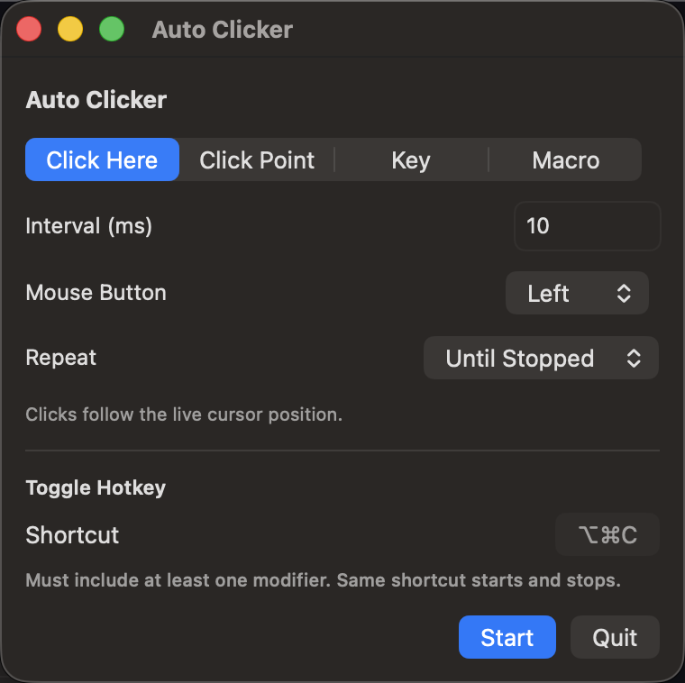

# Auto Clicker

Native macOS app that repeats mouse clicks, key presses, and short macros. It lives in the menu bar and also opens a Dock window with the same controls.

Requires macOS 14 or later.



## Download

macOS 14 or later, Apple silicon.

1. Open the [latest release](https://github.com/bear-seal-os/auto-clicker/releases/latest).
2. Download `AutoClicker-macos.zip` and unzip it.
3. Right-click `AutoClicker.app` and choose **Open**, then **Open** again.
4. If macOS blocks it, use **System Settings → Privacy & Security → Open Anyway**.

This build is ad-hoc signed and not notarized, so macOS warns on first launch. Each new release needs Accessibility turned on again.

The installed app checks GitHub on launch. When a newer version is listed, choose **Update**. The app quits, replaces itself, and reopens.

## Build and run

```bash
./scripts/build-app.sh --open
```

The script builds a release binary, wraps it in `AutoClicker.app`, and code-signs it. If an Apple Development identity is available, it uses that. Otherwise it ad-hoc signs the app, and macOS will ask for Accessibility again after every rebuild.

To build without launching:

```bash
./scripts/build-app.sh
open AutoClicker.app
```

## Permission

Clicks, keys, and point picking need Accessibility access.

1. Open the app.
2. Choose **Open Settings** in the panel, or go to **System Settings → Privacy & Security → Accessibility**.
3. Enable **Auto Clicker**.

**Start** stays disabled until that permission is granted.

## Usage

Pick a mode, set the interval and repeat options, then press **Start** or the toggle hotkey. The same hotkey stops a run. The menu-bar icon fills while a run is active.

| Mode            | What it does                                                                 |
| --------------- | ---------------------------------------------------------------------------- |
| **Click Here**  | Clicks wherever the cursor is, on an interval.                               |
| **Click Point** | Clicks a fixed point. Type coordinates or use **Pick** and click the screen. |
| **Key**         | Repeats a captured key chord.                                                |
| **Macro**       | Plays an ordered list of click, key, and wait steps.                         |

Shared controls:

- **Interval** — milliseconds between actions. Minimum 10, default 100. Not used in Macro mode.
- **Mouse Button** — Left or Right. Disabled in Key mode.
- **Repeat** — **Until Stopped**, or **Count** for a fixed number of repetitions.

Macro steps each have their own interval. **Loop interval** is the pause between full passes of the step list.

**Toggle Hotkey** defaults to ⌃⌥C. It must include at least one modifier, and it both starts and stops the current run.

## Tests

```bash
swift test
```

## License

[MIT](LICENSE)
